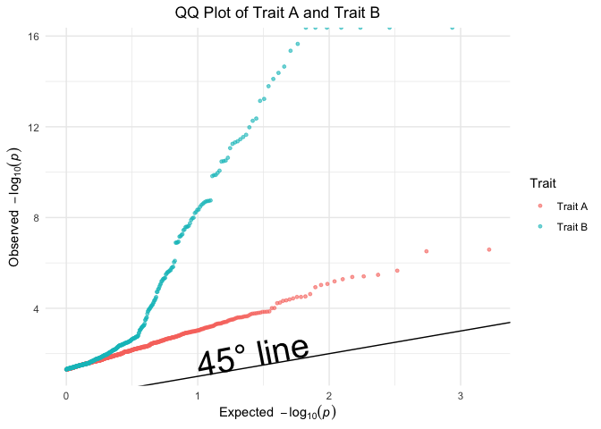

SSGAC Data Task
================

``` r
library(tidyverse)
```

# Load the data

``` r
# Load the data
data_A <- read_table("Data_Task/Data/sumstats_trait_A.txt")
data_B <- read_table("Data_Task/Data/sumstats_trait_B.txt")
```

# Question1:

# check the data and clean or fix

## get a full data set

### missing value in position

We can find there are many missing values in the position information,
so we need to modify the data.

``` r
reorder_columns_if_pos <- function(data_frame) {
    data_name <- deparse(substitute(data_frame))
    rows_to_change <- which(data_frame$BPOS %in% c("T", "C", "G", "A"))
    cat("There are", length(rows_to_change), "rows to change in", data_name, "\n")

    data_frame_new <- data_frame[rows_to_change, ] |>
        dplyr::mutate(
            info = NCHROBS,
            NCHROBS = z,
            z = beta_hat,
            beta_hat = N,
            N = MAF,
            MAF = A2,
            A2 = A1,
            A1 = BPOS,
            BPOS = NA
        )

    # combine the new data with the original data
    data_frame_final <- rbind(data_frame[-rows_to_change, ], data_frame_new)

    # return the final data frame
    return(data_frame_final)
}
```

``` r
data_A <- reorder_columns_if_pos(data_A)
```

    ## There are 701 rows to change in data_A

``` r
data_B <- reorder_columns_if_pos(data_B)
```

    ## There are 701 rows to change in data_B

There are 701 rows to change in data_A and data_B.

### missing value in NCHROBS

We find that the individuals who lose its NCHROBS also lose its z and
info, so we find that we should replace NCHROBS with beta_hat.

``` r
fix_nchrobs_missing <- function(data_frame) {
    data_name <- deparse(substitute(data_frame))
    # find the rows with missing NCHROBS
    rows_to_change <- which(is.na(data_frame$NCHROBS))
    cat("There are", length(rows_to_change), "rows with missing NCHROBS in", data_name, "\n")

    # replace NCHROBS with beta_hat
    data_frame_new <- data_frame[rows_to_change, ] |>
        dplyr::mutate(
            NCHROBS = beta_hat,
            beta_hat = NA
        )

    # combine the new data with the original data
    data_frame_final <- rbind(data_frame[-rows_to_change, ], data_frame_new) |>
        dplyr::mutate(MAF = as.numeric(MAF))

    return(data_frame_final)
}
```

``` r
data_A <- fix_nchrobs_missing(data_A)
```

    ## There are 345 rows with missing NCHROBS in data_A

``` r
data_B <- fix_nchrobs_missing(data_B)
```

    ## There are 345 rows with missing NCHROBS in data_B

There are 345 rows with missing NCHROBS in data_A and data_B.

Now we have the full data set and can have a further check on each
variable.

## check each variable

### check A1, A2 and MAF

We need to check the A1, A2 and MAF. The A1 and A2 should be one of “A”,
“C”, “G” and “T”. The MAF should be between 0 and 0.5. A1 should be
differenct form A2.

``` r
filter_valid_snps <- function(data) {
    data_name <- deparse(substitute(data))
    # check the A1, A2 and MAF
    data_filtered <- data |>
        dplyr::filter(
            A1 %in% c("A", "C", "G", "T") &
                A2 %in% c("A", "C", "G", "T") &
                MAF > 0 & MAF < 0.5 &
                A1 != A2
        )
    cat(nrow(data) - nrow(data_filtered), "snps are filtered out due to A1, A2 and MAF in the", data_name, "\n")
    return(data_filtered)
}
```

``` r
data_A_filtered <- filter_valid_snps(data_A)
```

    ## 2152 snps are filtered out due to A1, A2 and MAF in the data_A

``` r
data_B_filtered <- filter_valid_snps(data_B)
```

    ## 2070 snps are filtered out due to A1, A2 and MAF in the data_B

2152 snps are filtered out due to A1, A2 and MAF in the data_A. 2070
snps are filtered out due to A1, A2 and MAF in the data_B.

### check the accuracy and significance of z

Cause we use a two-sided test, so we assume a 95% significance level and
the z value should be out of -1.96 and 1.96.

``` r
filter_significant_snps <- function(data, info_threshold = 0.9, NCHROBS_threshold = 800000, N_threshold = 70000, alpha = 0.05) {
    data_name <- deparse(substitute(data))
    data_filtered <- data |>
        dplyr::filter(
            abs(z) > qnorm(1 - alpha / 2) &
                info > info_threshold & info <= 1 &
                NCHROBS > NCHROBS_threshold &
                N > N_threshold
        )
    cat(nrow(data) - nrow(data_filtered), "snps are filtered out due to small sample size or significance in", deparse(substitute(data)), "\n")
    return(data_filtered)
}
```

``` r
data_A_filtered <- filter_significant_snps(data_A_filtered)
```

    ## 7023 snps are filtered out due to small sample size or significance in data_A_filtered

``` r
data_B_filtered <- filter_significant_snps(data_B_filtered)
```

    ## 7498 snps are filtered out due to small sample size or significance in data_B_filtered

7023 snps are filtered out due to small sample size or significance in
data_A_filtered. 7498 snps are filtered out due to small sample size or
significance in data_B_filtered.

Since GWAS is essentially similar to simple linear regression (SLR), the
beta and z values should have the same sign. If they have the opposite
sign, we should flip it.

``` r
data_A_new <- data_A_filtered |>
    filter((beta_hat > 0 & z > 0) | (beta_hat < 0 & z < 0))
cat(nrow(data_A_filtered) - nrow(data_A_new), "snps are filtered out due to different sign between beta and z in data A set. \n")
```

    ## 0 snps are filtered out due to different sign between beta and z in data A set.

``` r
data_B_new <- data_B_filtered |>
    filter((beta_hat > 0 & z > 0) | (beta_hat < 0 & z < 0))
cat(nrow(data_B_filtered) - nrow(data_B_new), "snps are filtered out due to different sign between beta and z in data B set. \n")
```

    ## 0 snps are filtered out due to different sign between beta and z in data B set.

no need to flip the sign.

### position information: SNP, CHR, BPOS

We need to check the SNP, CHR and BPOS. The SNP should be unique and the
CHR should be 22. The BPOS should be unique in each chromosome.

``` r
# check the CHR
any(!(data_A_new$CHR == 22))
```

    ## [1] FALSE

``` r
any(!(data_B_new$CHR == 22))
```

    ## [1] FALSE

``` r
cat("there is no snp from other chromosome in data A and B set.\n")
```

    ## there is no snp from other chromosome in data A and B set.

``` r
deduplicate_snps_by_info <- function(data) {
    data_name <- deparse(substitute(data))
    duplicated_count <- sum(duplicated(data$SNP))
    cat("There are", duplicated_count, "duplicated SNPs in", data_name, "\n")

    data_dedup <- data |>
        dplyr::group_by(SNP) |>
        dplyr::arrange(dplyr::desc(info)) |>
        dplyr::slice(1) |>
        dplyr::ungroup()

    return(data_dedup)
}
```

``` r
data_A_new <- deduplicate_snps_by_info(data_A_new)
```

    ## There are 1 duplicated SNPs in data_A_new

``` r
data_B_new <- deduplicate_snps_by_info(data_B_new)
```

    ## There are 0 duplicated SNPs in data_B_new

1 duplicated snp has been removed in data A and B set. (we retain the
one with the highest info value)

# find common SNP in two traits

Now we get two data_set cleaned, and we can find the common SNPs in two
traits.

``` r
intersect_snp <- intersect(data_A_new$SNP, data_B_new$SNP)

combine_df <-
    rbind(
        data_A_new[data_A_new$SNP %in% intersect_snp, ],
        data_B_new[data_B_new$SNP %in% intersect_snp, ]
    ) |>
    select(-c(CHR, BPOS)) |>
    arrange(SNP)

combine_df_new <-
    combine_df |>
    group_by(SNP) |>
    filter(
        dplyr::n() == 2,
        length(unique(A1)) == 1,
        length(unique(A2)) == 1,
        length(unique(MAF)) == 1
    ) |>
    dplyr::ungroup()

snp_final <- unique(combine_df_new$SNP)
length(snp_final)
```

    ## [1] 46

``` r
setdiff(intersect_snp, snp_final)
```

    ## [1] "rs12072405" "rs4662139"

two snp has been removed in the final data set. we have left 46 snps,
namely rs1010069, rs10489156, rs10492970, rs10864499, rs10916668,
rs10916878, rs11121356, rs11121608, rs11809957, rs12068489, rs12092513,
rs12406819, rs1253885, rs1500968, rs16824697, rs17034563, rs1935229,
rs2076608, rs2128699, rs214342, rs2213802, rs2355, rs2483266, rs2842258,
rs3101219, rs3789498, rs3789559, rs3806308, rs3820034, rs4129341,
rs4465231, rs4466678, rs4518869, rs4661529, rs4846064, rs4920478,
rs590925, rs6669417, rs6670516, rs6692648, rs677214, rs735000, rs761087,
rs879484, rs9430631, rs9439468.

# find the snp in data set A with the biggest absolute z

``` r
snp_biggest_z <-
    data_A_new |>
    filter(SNP %in% snp_final) |>
    mutate(abs_z = abs(z)) |>
    arrange(desc(abs_z)) |>
    slice(1) |>
    select(SNP)
```

the snp in data set A with the biggest absolute z is rs214342.

# Question 2:

## produce a Q-Q plot

``` r
# get the pvalue
data_A_new$pval <- 2 * (1 - pnorm(abs(data_A_new$z)))
data_B_new$pval <- 2 * (1 - pnorm(abs(data_B_new$z)))

# sort the p-value
p_A_clean <- sort(na.omit(data_A_new$pval))
p_B_clean <- sort(na.omit(data_B_new$pval))

# A df
expected_A <- -log10(ppoints(length(p_A_clean)))
observed_A <- -log10(p_A_clean)

df_A <- data.frame(
    Expected = expected_A,
    Observed = observed_A,
    Trait = "Trait A"
)

# B df
observed_B <- -log10(p_B_clean)
expected_B <- -log10(ppoints(length(p_B_clean)))

df_B <- data.frame(
    Expected = expected_B,
    Observed = observed_B,
    Trait = "Trait B"
)

# combine the data frame
df <- rbind(df_A, df_B)

ggplot(df, aes(x = Expected, y = Observed, color = Trait)) +
    geom_point(size = 1, alpha = 0.6) +
    geom_abline(slope = 1, intercept = 0, linetype = 1, color = "black") +
    annotate("text", x = 1, y = 1.5, label = "45° line", angle = 11, hjust = 0, size = 10) +
    labs(
        title = "QQ Plot of Trait A and Trait B",
        x = expression(Expected ~ ~ -log[10](italic(p))),
        y = expression(Observed ~ ~ -log[10](italic(p))),
        color = "Trait"
    ) +
    theme_minimal() +
    theme(plot.title = element_text(hjust = 0.5))
```

<!-- -->

## interpret the Q-Q plot

The 45-degree line in the QQ plot represents the distribution of
p-values we would expect under the global null hypothesis—i.e., if none
of the SNPs are associated with the trait.

In this analysis, deviations from the line suggest inflation or
enrichment of small p-values. Specifically, the p-values for Trait B
show a marked upward deviation from the 45-degree line, indicating
strong evidence of association between SNPs and the trait. In contrast,
Trait A follows the null line more closely, suggesting fewer or weaker
signals of association.

## why it should be monotonic

QQ plots are inherently monotonic because they plot quantiles of two
distributions, both of which are sorted in ascending order. As a result,
each successive point must have equal or higher x and y values than the
previous one, making the plot monotonically increasing regardless of the
specific data being compared.

## describe the trend of different traits

In the QQ plot, the data for Trait A closely follows the 45-degree line,
indicating that most SNPs do not deviate from the null distribution.
This suggests few, if any, SNPs are significantly associated with Trait
A.

In contrast, Trait B shows a substantial upward deviation from the
45-degree line, especially in the tail, which indicates strong
enrichment of small p-values. This suggests that many SNPs are likely
associated with Trait B, and the genetic signal is stronger compared to
Trait A.
